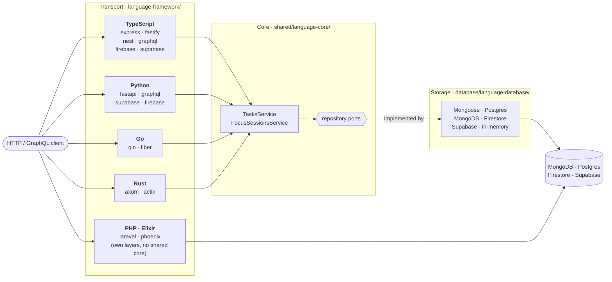

# Cero a Producción — API

0️⃣ 🚀 **Cero a Producción** is a series of live coding sessions where we build
**RETO**, a productivity app, from scratch to production — real decisions,
failing tests, refactors and all.

📺 [YouTube](https://glrz.me/youtube-cero) · 🟣 [Twitch](https://glrz.me/stream)
(live in 🇪🇸 Spanish, Tuesdays to Fridays)

Part of the [Cero a Producción project](https://github.com/glrodasz/cero).

## What this is

The **backend** of RETO (tasks and focus sessions) implemented over and over in
different languages and frameworks: a *TodoMVC for backends*. Every
implementation serves **the same API** ([`shared/api-contract.md`](shared/api-contract.md))
and passes **the same black-box test suite** ([`shared/contract-tests`](shared/contract-tests)),
so they can be compared on one real problem.

> ⚠️ [`cero-web`](https://github.com/glrodasz/cero-web) does not consume this
> API yet; it still runs on `json-server` locally.

## How the code is organised

Each language splits the work into three layers, so two frameworks of the same
language differ only where the frameworks really differ:



| Layer | Where | Holds |
| --- | --- | --- |
| **Core** | `shared/<language>-core` | Domain rules, use cases (`TasksService`, `FocusSessionsService`), storage ports, an in-memory adapter |
| **Storage** | `database/<language>-<database>` | One adapter per database, proven by the core's *repository contract* tests |
| **Transport** | `<language>-<framework>` | Routes, validation, error → status code, and the composition root |

Laravel and Phoenix are the only frameworks in their languages, so they use
their framework's own layering (actions and Eloquent; contexts and Ecto).
[`shared/README.md`](shared/README.md) explains the design and maps the names
across languages.

## Implementations

| Implementation | Docs | Stack | Storage | Port | Contract suite |
| --- | --- | --- | --- | --- | --- |
| [`typescript-express`](typescript-express) | [README](typescript-express/README.md#architecture) | Express 5, zod | MongoDB (Mongoose), memory | 3000 | ✅ 58/58 |
| [`typescript-fastify`](typescript-fastify) | [README](typescript-fastify/README.md#architecture) | Fastify 5, TypeBox | MongoDB (Mongoose), memory | 3001 | ✅ 58/58 |
| [`typescript-nest`](typescript-nest) | [README](typescript-nest/README.md#architecture) | NestJS 12, class-validator | MongoDB (Mongoose), memory | 3002 | ✅ 58/58 |
| [`typescript-graphql`](typescript-graphql) | [README](typescript-graphql/README.md#architecture) | GraphQL Yoga 5, schema-first | MongoDB (Mongoose), memory | 3003 | ✅ 43/43 (GraphQL) |
| [`typescript-firebase`](typescript-firebase) | [README](typescript-firebase/README.md#architecture) | Cloud Functions 2nd gen + the Express app | Firestore (emulator) | 5001 | ✅ 57/57 + 1 platform limit¹ |
| [`typescript-supabase`](typescript-supabase) | [README](typescript-supabase/README.md#architecture) | Supabase Edge Function, Deno + Hono | Supabase Postgres (supabase-js) | 54321 | ✅ 58/58 |
| [`python-fastapi`](python-fastapi) | [README](python-fastapi/README.md#architecture) | FastAPI, Pydantic | Postgres (SQLAlchemy), MongoDB (PyMongo), memory | 8000 | ✅ 58/58 |
| [`python-graphql`](python-graphql) | [README](python-graphql/README.md#architecture) | Strawberry, code-first | Postgres, MongoDB, memory | 8001 | ✅ 43/43 (GraphQL) |
| [`python-supabase`](python-supabase) | [README](python-supabase/README.md#architecture) | The FastAPI app over supabase-py | Supabase Postgres (supabase-py) | 8002 | ✅ 58/58 |
| [`python-firebase`](python-firebase) | [README](python-firebase/README.md#architecture) | Cloud Functions (Python) + the FastAPI app | Firestore (emulator) | 5002 | ✅ 58/58 |
| [`go-gin`](go-gin) | [README](go-gin/README.md#architecture) | Gin | Postgres (pgx), memory | 8080 | ✅ 58/58 |
| [`go-fiber`](go-fiber) | [README](go-fiber/README.md#architecture) | Fiber v3 | Postgres (pgx), memory | 8081 | ✅ 58/58 |
| [`rust-axum`](rust-axum) | [README](rust-axum/README.md#architecture) | Axum 0.8 | Postgres (sqlx), memory | 8090 | ✅ 58/58 |
| [`rust-actix`](rust-actix) | [README](rust-actix/README.md#architecture) | Actix Web 4 | Postgres (sqlx), memory | 8091 | ✅ 58/58 |
| [`php-laravel`](php-laravel) | [README](php-laravel/README.md#architecture) | Laravel 13, Eloquent | Postgres | 8100 | ✅ 58/58 |
| [`elixir-phoenix`](elixir-phoenix) | [README](elixir-phoenix/README.md#architecture) | Phoenix 1.8, Ecto | Postgres | 4000 | ✅ 58/58² |

¹ Cloud Functions parses JSON bodies before the app runs, so malformed JSON
gets the platform's HTML 400 instead of `{ "message" }`.
² Verified in the official Elixir image with dependencies built from source;
see [its README](elixir-phoenix/README.md) for why there is no `mix.lock` yet.

Still planned: storage adapters with other TypeScript drivers
(`database/typescript-mongodb`, `typescript-postgres`, `sequelize-postgres`,
`typeorm-postgres`). The TypeScript ports make each one a single new package.

## Shared pieces

| Piece | Docs | What it is |
| --- | --- | --- |
| API contract | [`shared/api-contract.md`](shared/api-contract.md) | The REST API, endpoint by endpoint ([GraphQL schema](shared/graphql/schema.graphql)) |
| Layers and naming | [`shared/README.md`](shared/README.md) | How core, storage and transport fit together, in every language |
| Cores | [TypeScript](shared/typescript-core/README.md#architecture) · [Python](shared/python-core/README.md#architecture) · [Go](shared/go-core/README.md#architecture) · [Rust](shared/rust-core/README.md#architecture) | Domain rules, services and storage ports per language |
| TypeScript storage | [Mongoose](database/typescript-mongoose/README.md) · [Firestore](database/typescript-firestore/README.md) · [Supabase](database/typescript-supabase/README.md) | Adapters for `@cero/core` |
| Python storage | [Postgres](database/python-postgres/README.md) · [MongoDB](database/python-mongodb/README.md) · [Firestore](database/python-firestore/README.md) · [Supabase](database/python-supabase/README.md) | Adapters for `cero-core` |
| Go / Rust storage | [go-postgres](database/go-postgres/README.md) · [rust-postgres](database/rust-postgres/README.md) | Adapters for `go-core` / `cero-core` |
| Postgres schema | [`database/postgres/schema.sql`](database/postgres/schema.sql) | Reference tables every Postgres stack follows |
| Test plans | [`shared/core-test-plan.md`](shared/core-test-plan.md) · [`shared/contract-tests`](shared/contract-tests) | Unit cases every core implements; the black-box suite every API passes |

## Running an implementation

1. Start the databases. One `docker-compose.yml` serves every stack, with a
   database per language inside each server:

   ```bash
   docker compose up -d            # MongoDB on 27017, Postgres on 5432 (root / root)
   ```

   Most stacks can skip this with `STORAGE=memory`.

2. Follow the README of the implementation. Each one explains its idioms, where
   things live, and how to run and test it.

All TypeScript packages share one Yarn workspace, all Python packages one uv
workspace, and all Rust crates one Cargo workspace, at the repository root. Go,
PHP and Elixir projects are standalone.

## Checking an implementation against the contract

The runner boots an implementation, runs the suite against it, and stops it:

```bash
yarn install
yarn contract go-gin                    # any name from shared/contract-tests/apps.json
STORAGE=memory yarn contract go-gin     # environment variables reach the app
```

To test a server that is already running:

```bash
API_URL=http://127.0.0.1:8080 yarn workspace @cero/contract-tests suite
API_PROTOCOL=graphql API_URL=http://127.0.0.1:8001/graphql yarn workspace @cero/contract-tests suite
```

## Adding an implementation

1. Reuse your language's core, or port [`shared/typescript-core`](shared/typescript-core)
   together with the cases in [`shared/core-test-plan.md`](shared/core-test-plan.md).
2. Reuse or write a storage adapter, and make it pass the repository contract.
3. Write the transport layer: routes, validation, error mapping, composition root.
4. Register it in [`shared/contract-tests/apps.json`](shared/contract-tests/apps.json)
   and make `yarn contract <name>` pass.

## Folder structure

```
├── docker-compose.yml          MongoDB + Postgres for every stack
├── shared/
│   ├── api-contract.md         the API, endpoint by endpoint
│   ├── graphql/                the same API as a GraphQL schema
│   ├── contract-tests/         black-box suite + runner (apps.json)
│   ├── core-test-plan.md       unit tests every core implements
│   ├── typescript-core/        reference core
│   ├── python-core/
│   ├── go-core/
│   └── rust-core/
├── database/
│   ├── postgres/               init script (one database per language) + reference schema
│   ├── typescript-mongoose/    typescript-firestore/    typescript-supabase/
│   ├── python-postgres/        python-mongodb/          python-supabase/    python-firestore/
│   ├── go-postgres/
│   └── rust-postgres/
├── typescript-express/  typescript-fastify/  typescript-nest/  typescript-graphql/
├── typescript-firebase/ typescript-supabase/
├── python-fastapi/      python-graphql/      python-supabase/  python-firebase/
├── go-gin/              go-fiber/
├── rust-axum/           rust-actix/
├── php-laravel/
└── elixir-phoenix/
```
