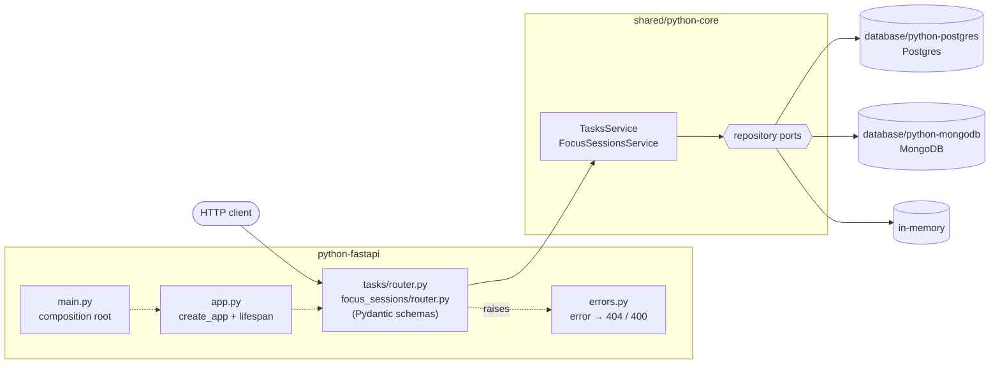

# python-fastapi

The Cero API on **FastAPI**, storing data in Postgres
([`cero-postgres`](../database/python-postgres)), MongoDB
([`cero-mongodb`](../database/python-mongodb)) or memory.

## Architecture



1. [`main.py`](src/cero_fastapi/main.py) passes the opener that `STORAGE` picks (`postgres` by default, `mongodb` or `memory`; see [`storage.py`](src/cero_fastapi/storage.py)) to `create_app`, whose lifespan opens it and builds the services with `create_services`.
2. A router validates the request with its Pydantic models and calls one service method, injected through [`dependencies.py`](src/cero_fastapi/dependencies.py).
3. The service applies the business rules and reads or writes through the repository ports.
4. Whatever it raises reaches [`errors.py`](src/cero_fastapi/errors.py): `NotFoundError` → 404, `ValidationError` → 400, as `{"message"}`.

## What this stack shows

- **An app factory with a lifespan.** `create_app(open_storage)`
  ([`src/cero_fastapi/app.py`](src/cero_fastapi/app.py)) opens storage when the
  server starts, puts the services on `app.state`, and closes storage on
  shutdown. The app never chooses its storage: `open_storage` is any async
  context manager that yields `Repositories`, which is how python-supabase
  serves this same app over Supabase.
- **One `APIRouter` per feature,** with dependencies declared once as
  `Annotated[TasksService, Depends(...)]` ([`src/cero_fastapi/dependencies.py`](src/cero_fastapi/dependencies.py))
  and used as plain parameter types.
- **Pydantic v2 at the edge.** Request and response models
  ([`tasks/schemas.py`](src/cero_fastapi/tasks/schemas.py),
  [`focus_sessions/schemas.py`](src/cero_fastapi/focus_sessions/schemas.py))
  speak camelCase through an alias generator. Strict types turn `"42"` for a
  number into a 400 instead of coercing it; unknown fields are ignored.
- **Handlers return core entities.** `response_model=` converts the frozen
  dataclasses into camelCase JSON, so routes stay one line long.
- **Route order is declaration order.** `/{task_id}/complete` is declared before
  `/{task_id}/{status}`, where `status: TaskStatus` makes FastAPI reject unknown
  statuses.
- **Exception handlers instead of try/except**
  ([`src/cero_fastapi/errors.py`](src/cero_fastapi/errors.py)): core errors become
  404/400, FastAPI's validation errors become 400 (not 422), unknown routes and
  methods become `404 {"message": "Not found"}`, anything else an opaque 500.
- **Settings are validated** by pydantic-settings
  ([`src/cero_fastapi/settings.py`](src/cero_fastapi/settings.py)).
- **Tests without a port.** httpx's `ASGITransport` sends requests straight into
  the app ([`tests/test_fastapi_app.py`](tests/test_fastapi_app.py)).

## Where things live

```
src/cero_fastapi/
├── main.py                       composition root: settings → storage → app (what `fastapi run` serves)
├── app.py                        create_app(open_storage): lifespan, routers, error handlers
├── settings.py                   environment variables
├── storage.py                    STORAGE → the storage opener
├── dependencies.py               Annotated dependencies for the services
├── errors.py                     exception → status code and {"message"}
├── api_model.py                  camelCase base model
├── tasks/                        /tasks router and its models
└── focus_sessions/               /focus-sessions router and its models
```

The business rules are not here: they live in
[`shared/python-core`](../shared/python-core).

## Run it

From the repository root:

```bash
uv sync
docker compose up -d postgres             # or mongo, or skip it and use STORAGE=memory
(cd database/python-postgres && uv run alembic upgrade head)
cp python-fastapi/.env.example python-fastapi/.env
cd python-fastapi && uv run fastapi run   # `uv run fastapi dev` reloads on changes
```

The API listens on http://localhost:8000 (`PORT` changes it), with
interactive docs at http://localhost:8000/docs.

## Test it

```bash
uv run pytest python-fastapi                # FastAPI-specific behaviour
yarn contract python-fastapi                # the shared API contract, end to end
```
