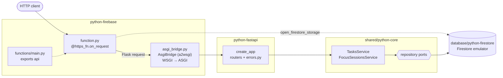

# python-firebase

The Cero API as a **Cloud Function for Firebase** (2nd gen) written in
**Python**: the app of [`python-fastapi`](../python-fastapi), unchanged,
storing data in **Firestore** through
[`cero-firestore`](../database/python-firestore). It runs locally on the
Firebase Emulator Suite, with no Google account.

## Architecture



1. Firebase loads [`functions/main.py`](functions/main.py), which exports `api` from [`function.py`](src/cero_firebase/function.py), the composition root: `AsgiBridge(create_app(open_firestore_storage))`. There is no `STORAGE` switch: it is always Firestore.
2. `api` gets a Flask (WSGI) request; [`AsgiBridge`](src/cero_firebase/asgi_bridge.py) runs it through [python-fastapi](../python-fastapi)'s ASGI app, whose routers validate it and call one service method.
3. The service applies the business rules through the repository ports; `cero-firestore` reads and writes Firestore (the emulator, locally).
4. Whatever it raises reaches python-fastapi's `errors.py`: `NotFoundError` → 404, `ValidationError` → 400.

## What this stack shows

- **FastAPI inside a Flask function.** A Python HTTPS function
  (`@https_fn.on_request()`) receives a Flask request and returns a Flask
  response: it speaks WSGI. FastAPI speaks ASGI. The function hands the
  request's WSGI environment to python-fastapi's app through an ASGI→WSGI
  bridge, `Response.from_app(wsgi_app, request.environ)`
  ([`src/cero_firebase/function.py`](src/cero_firebase/function.py)): the same
  move as Firebase's documented pattern for Flask apps, for any WSGI app.
- **The bridge does what an ASGI server would**
  ([`src/cero_firebase/asgi_bridge.py`](src/cero_firebase/asgi_bridge.py)).
  [a2wsgi](https://github.com/abersheeran/a2wsgi) translates the requests;
  `AsgiBridge` adds the rest:
  - **one event loop per instance**, in a daemon thread, for every request:
    the Firestore async client, bound to the loop of its first request, is
    created once and shared. A request costs a hand-off between the WSGI
    thread and that loop, never a new app, client or connection;
  - **the lifespan, which opens storage, runs on the first request**, once,
    under a lock. Firebase imports the function's module to discover it, also
    while deploying, when nothing may connect; and the functions framework
    imports it in gunicorn's master process, whose threads the forked worker
    does not inherit. A loop started at import time would never run;
  - **unexpected errors are logged:** Starlette answers 500, then re-raises for
    the server to log, and a2wsgi keeps the error to itself.
- **Malformed JSON gets the contract's answer.** Node's functions runtime parses
  JSON bodies before the function runs, which is why
  [`typescript-firebase`](../typescript-firebase) cannot pass that contract
  check. Python's hands Flask the raw body, so FastAPI answers
  `400 {"message": ...}`: the whole contract passes here.
- **Platform-native storage.** Firestore through google-cloud-firestore, which
  talks to the emulator whenever `FIRESTORE_EMULATOR_HOST` is set (the emulator
  sets it for the function, with the project in `GCLOUD_PROJECT`).
- **A demo project.** `.firebaserc` names `demo-cero-python`: projects starting
  with `demo-` need no credentials and can only reach emulators.
- **Deny-all rules.** Clients never touch Firestore directly; the function's
  server client bypasses [`firestore.rules`](firestore.rules).
- **The function lives in a package.** Firebase loads
  [`functions/main.py`](functions/main.py), which only exports `api` from
  `cero_firebase`. That package is a member of the uv workspace, so ruff,
  mypy --strict and pytest cover it from the repository root like every other
  Python package.

## Where things live

```
python-firebase/
├── firebase.json                functions source and runtime (python313), Firestore rules and indexes, emulator ports
├── .firebaserc                  project: demo-cero-python
├── firestore.rules              deny every client
├── firestore.indexes.json       composite indexes the list queries need in production
├── src/cero_firebase/
│   ├── function.py              composition root: Firestore → python-fastapi's app → bridge → on_request
│   └── asgi_bridge.py           AsgiBridge: event loop, lifespan and error logging around a2wsgi
├── tests/
│   ├── test_asgi_bridge.py      the bridge, on a bare FastAPI app
│   └── test_firebase_function.py   the function serves the app and stores in Firestore
└── functions/                   what Firebase deploys
    ├── main.py                  exports `api` from cero_firebase
    ├── requirements.txt         installs the workspace packages into venv/
    └── venv/                    created by you (not committed)
```

The HTTP layer lives in [`python-fastapi`](../python-fastapi), the business
rules in [`shared/python-core`](../shared/python-core) and the storage in
[`database/python-firestore`](../database/python-firestore).

## functions/venv and requirements.txt

Firebase runs Python functions from `functions/venv`, a virtual environment
you create from `functions/requirements.txt`. Here that file installs this
repository's packages from source, editable, by relative path: the core, the
Firestore adapter, python-fastapi (with the Postgres and MongoDB adapters it
depends on, unused here) and `cero_firebase`. Their third-party dependencies
come from their `pyproject.toml` files. The emulator therefore always runs the
workspace's code; reinstall only when a dependency changes. pip and uv read the
relative paths from the current folder, so install from `functions/`.

Two virtual environments, then: the workspace's `.venv` (from `uv sync`),
where ruff, mypy and pytest run, and `functions/venv`, where Firebase runs the
function.

## Run it on the emulators

Needs Java 21 (the Firestore emulator is a Java program), uv and Node (the
Firebase CLI runs through `npx`). The first run downloads the emulators.

```bash
cd python-firebase/functions
uv venv venv && uv pip install --python venv -r requirements.txt
# or, without uv: python3.13 -m venv venv && venv/bin/pip install -r requirements.txt
npx firebase-tools@15 emulators:start --only functions,firestore --project demo-cero-python
```

The API is the function's URL:
http://127.0.0.1:5002/demo-cero-python/us-central1/api (for example
`GET .../api/tasks`). The Emulator UI is off, because its default port (4000)
is Phoenix's. Every port differs from typescript-firebase's, so both run at once:

| Emulator | Port |
| --- | --- |
| Functions | 5002 |
| Firestore | 8181 (websocket 9181) |
| Hub / logging | 4410 / 4510 |
| Eventarc / Cloud Tasks (started with the functions emulator) | 9281 / 9481 |

The function is loaded a few seconds after port 5002 opens; until then the
emulator answers `404 Function us-central1-api does not exist`. Each Python
worker is a `functions-framework` process on a free port picked from 8081 up,
where some of this repository's servers listen: start those first.

## Test it

With the emulators running, from the repository root (the tests only use Firestore, in
projects of their own):

```bash
uv run pytest python-firebase               # the bridge, and the function over Firestore
uv run pytest database/python-firestore     # the storage adapter
yarn contract python-firebase               # the shared API contract, end to end
```

## What a real deploy would also need

- **Vendored packages.** `firebase deploy` uploads `functions/` alone, and
  Cloud Build installs its `requirements.txt` there, where the `../../` paths
  do not exist. Build the workspace packages as wheels into `functions/` and
  list them, with the third-party versions pinned by `uv.lock`, in the
  requirements file that gets deployed (a `predeploy` step in `firebase.json`
  can run this):

  ```bash
  cd python-firebase/functions
  for package in cero-core cero-firestore cero-postgres cero-mongodb cero-fastapi cero-firebase; do
    uv build --package "$package" --wheel --out-dir wheels
  done
  uv export --package cero-firebase --no-dev --no-hashes --no-emit-workspace -o requirements.txt
  ls wheels/*.whl | sed 's|^|./|' >> requirements.txt
  ```

- A Firebase project on the pay-as-you-go (Blaze) plan, which Cloud Functions
  requires, selected with `firebase use --add` instead of `demo-cero-python`,
  and a Firestore database in it.
- `firebase deploy --only functions,firestore` deploys the function, the rules
  and the indexes. Composite indexes take a few minutes to build; until then
  the list queries fail.
- A decision about access: the API has no authentication, and HTTPS functions
  are publicly invokable by default. Region, memory, concurrency and minimum
  instances (cold starts) are options of `@https_fn.on_request(...)`.
