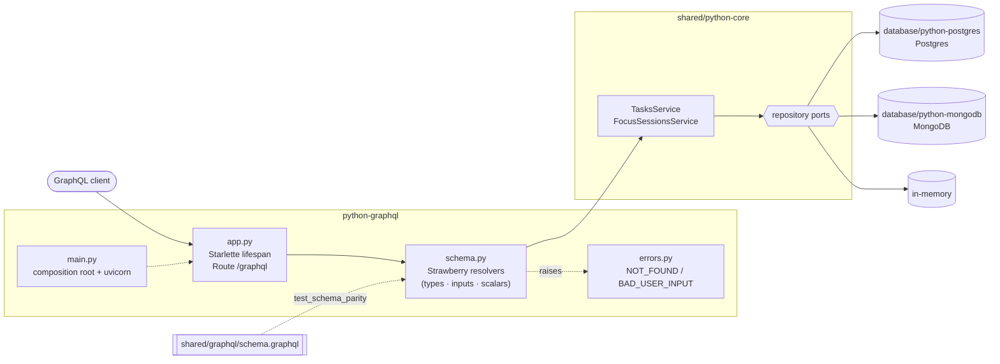

# python-graphql

The Cero API as **GraphQL**, code first with [Strawberry](https://strawberry.rocks),
storing data in Postgres, MongoDB or memory (the same adapters as
[`python-fastapi`](../python-fastapi)).

The schema is [`shared/graphql/schema.graphql`](../shared/graphql/schema.graphql),
written here as Python types; a test proves the two are the same.

## Architecture



1. [`main.py`](src/cero_graphql/main.py) passes the opener that `STORAGE` picks (`postgres` by default, `mongodb` or `memory`) to `create_app` and serves it with uvicorn; the lifespan builds the services with `create_services`.
2. `GraphQLApp` at `/graphql` hands each operation to a resolver in [`schema.py`](src/cero_graphql/schema.py), which calls one service method from `info.context`.
3. The service applies the business rules and reads or writes through the repository ports.
4. Whatever it raises reaches [`errors.py`](src/cero_graphql/errors.py): `NotFoundError` → `NOT_FOUND`, `ValidationError` → `BAD_USER_INPUT`, anything else is masked.

## What this stack shows

- **Code first.** Types are dataclass-like classes and resolvers are typed
  methods ([`src/cero_graphql/schema.py`](src/cero_graphql/schema.py)); Strawberry
  derives the SDL from the annotations. `snake_case` becomes `camelCase` on its own.
- **Schema parity, tested.** [`tests/test_schema_parity.py`](tests/test_schema_parity.py)
  prints both schemas in lexicographic order, without descriptions, and compares them.
- **The core's enums are the GraphQL enums.** `IN_PROGRESS` on the wire is
  `TaskStatus.IN_PROGRESS` (`"in-progress"`) in Python: no mapping code.
- **A custom scalar.** `Millis` ([`src/cero_graphql/scalars.py`](src/cero_graphql/scalars.py))
  carries epoch milliseconds, which overflow GraphQL's 32-bit `Int`. It is
  registered through `StrawberryConfig(scalar_map=...)`.
- **`UNSET` is not `None`.** In `UpdateTaskInput`
  ([`src/cero_graphql/inputs.py`](src/cero_graphql/inputs.py)) a missing
  `focusSessionId` leaves the task alone while `null` takes it out of its session.
- **Errors in one place.** A schema extension
  ([`src/cero_graphql/errors.py`](src/cero_graphql/errors.py)) gives the core's
  refusals `extensions.code` (`NOT_FOUND`, `BAD_USER_INPUT`) with their canonical
  messages, and masks anything unexpected as `Internal server error`. Only the
  unexpected ones are logged.
- **Hosted on Starlette, served by uvicorn.** Strawberry's ASGI app is built on
  Starlette already, so a small Starlette app ([`src/cero_graphql/app.py`](src/cero_graphql/app.py))
  adds what a bare GraphQL endpoint lacks, a lifespan that opens and closes
  storage, without bringing in FastAPI's routing and OpenAPI, which GraphQL does
  not use.

## Where things live

```
src/cero_graphql/
├── main.py           composition root: settings → storage → app → uvicorn
├── app.py            create_app(open_storage): Starlette lifespan + /graphql
├── schema.py         Query, Mutation and the schema
├── types.py          Task, Pause, FocusSession (built from core entities)
├── inputs.py         CreateTaskInput, UpdateTaskInput, StartFocusSessionInput
├── scalars.py        Millis
├── context.py        what resolvers get in info.context: the services
├── errors.py         core errors → extensions.code, everything else masked
├── settings.py       environment variables
└── storage.py        STORAGE → the storage opener
```

## Run it

From the repository root:

```bash
uv sync
docker compose up -d postgres         # or mongo, or skip it and use STORAGE=memory
(cd database/python-postgres && uv run alembic upgrade head)
cp python-graphql/.env.example python-graphql/.env
cd python-graphql && uv run cero-graphql
```

The endpoint is http://localhost:8001/graphql; open it in a browser for GraphiQL.
python-fastapi uses the same `cero_python` database, so run one of the two at a time.

## Test it

```bash
uv run pytest python-graphql                # schema parity and GraphQL-specific behaviour
yarn contract python-graphql                # the shared API contract, end to end
```
