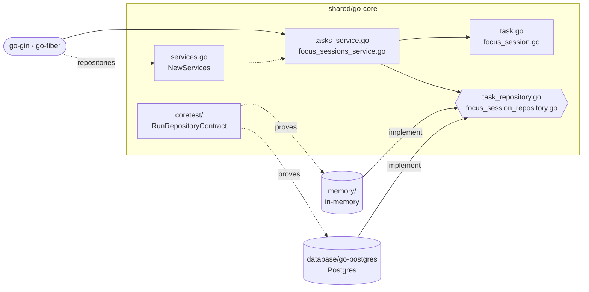

# go-core

The domain and use cases of the Cero API, shared by every Go implementation
([`go-gin`](../../go-gin), [`go-fiber`](../../go-fiber)). No framework, no
database, no third-party dependency: plain structs and functions.

It ports the [TypeScript reference core](../typescript-core): same services,
same 12 repository methods, same rules and canonical messages.

## Architecture



- A transport picks an adapter, passes its `Repositories` and a clock to `NewServices`, and calls the `TasksService` and `FocusSessionsService` it gets back.
- Services apply the pure rules of the domain types and reach storage only through the two repository ports: no framework, no driver.
- `coretest.RunRepositoryContract` runs the same cases against `memory/` and `database/go-postgres`, so either one can sit behind the ports.

## What this core shows

- **Errors are values.** Use cases return a `*NotFoundError` or a
  `*ValidationError` ([`errors.go`](errors.go)). Transports tell the kinds
  apart with `errors.AsType` (the generic `errors.As`); tests match one refusal
  with `errors.Is(err, core.ErrTaskNotFound)`.
- **Ports are interfaces, adapters satisfy them implicitly.**
  [`task_repository.go`](task_repository.go) and
  [`focus_session_repository.go`](focus_session_repository.go) take a
  `context.Context` first, so cancellation reaches the database.
- **Absent, null or a value.** A PATCH can leave `focusSessionId` alone, clear
  it, or set it. [`Optional[T]`](optional.go) tells "not given" from "given",
  and `Optional[*string]` adds null. Its `UnmarshalJSON` only runs for keys
  that are present, so transports decode a body straight into `TaskChanges`;
  null for a field that cannot be cleared is a type error.
- **Pure rules are value methods.** Like `time.Time.Add`,
  `session.Finish(now)` returns a changed copy and leaves the receiver alone
  ([`focus_session.go`](focus_session.go)).
- **Lists are never nil**, so they reach clients as `[]`, not `null`. The
  repository contract compares with `reflect.DeepEqual`, which tells the two
  apart.
- **Current Go.** The standard library's `uuid` package (Go 1.27),
  `errors.AsType`, and `new(expr)` in the tests.

## Where things live

```
go-core/
├── services.go                  NewServices(repos, clock): the composition root of the core
├── errors.go                    NotFoundError, ValidationError, Err* sentinels, Msg* canonical messages
├── clock.go                     Clock and SystemClock
├── optional.go                  Optional[T]: one field of a partial update
├── task.go                      Task, TaskChanges, pure rules (StatusForNewTask, Renumber)
├── task_repository.go           TaskRepository port and TaskFilter
├── tasks_service.go             TasksService
├── focus_session.go             FocusSession, Pause, pure rules (CloseOpenPause, Finish, ...)
├── focus_session_repository.go  FocusSessionRepository port
├── focus_sessions_service.go    FocusSessionsService
├── memory/                      in-memory adapter: memory.NewRepositories()
└── coretest/                    repository contract: coretest.RunRepositoryContract(t, ...)
```

## Using it

```go
services := core.NewServices(memory.NewRepositories(), core.SystemClock)
task, err := services.Tasks.Create(ctx, "Write the README")
```

## Writing a storage adapter

Implement `TaskRepository` and `FocusSessionRepository`, then prove it:

```go
func TestRepositoryContract(t *testing.T) {
	coretest.RunRepositoryContract(t, func(t *testing.T) core.Repositories {
		return mydb.NewRepositories(emptyDatabase(t))
	})
}
```

See [`database/go-postgres`](../../database/go-postgres) for a complete example.

## Test it

```bash
cd shared/go-core
go test ./...
```

The service tests follow [`core-test-plan.md`](../core-test-plan.md) case by
case, against the in-memory repositories and a clock moved by hand.
`memory/` runs the repository contract.
