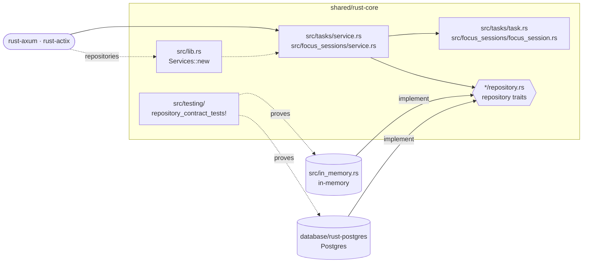

# cero-core (Rust)

The domain and use cases of the Cero API, shared by every Rust implementation
([`rust-axum`](../../rust-axum), [`rust-actix`](../../rust-actix)). No
framework, no database: plain types, traits and functions.

It ports the [TypeScript reference core](../typescript-core): same services,
same 12 repository methods, same rules, same canonical messages.

## Architecture



- A transport picks an adapter, passes its `Repositories` to `Services::new`, and calls the `TasksService` and `FocusSessionsService` it gets back.
- Services apply the pure rules of the domain types and reach storage only through the two repository traits: no framework, no driver.
- `repository_contract_tests!` generates the same tests for `in_memory` and `database/rust-postgres`, so either one can sit behind the traits.

## What this crate shows

- **Ports are traits behind `Arc<dyn …>`.** `TaskRepository` and
  `FocusSessionRepository` use `#[async_trait]`, because native `async fn` in
  traits cannot be called through `dyn`, and generic services would make every
  Axum and Actix handler generic too ([`src/lib.rs`](src/lib.rs)).
- **Types do part of the validation.** `TaskStatus` is an enum, so an unknown
  status is refused while the request body is read and never reaches a use
  case. `TaskChanges::focus_session_id` is an `Option<Option<String>>`: left
  out, `null` (detach) or an id ([`src/tasks/task.rs`](src/tasks/task.rs),
  [`src/serde_fields.rs`](src/serde_fields.rs)).
- **One error enum.** `CoreError::{NotFound, Invalid, Repository}`, built with
  `thiserror`; each transport maps it to 404 / 400 / 500 ([`src/error.rs`](src/error.rs)).
- **Pure rules take a value and return a new one.**
  `session.close_open_pause(now).start_pause(pause)`
  ([`src/focus_sessions/focus_session.rs`](src/focus_sessions/focus_session.rs)).
- **The repository contract is a macro.** `repository_contract_tests!` generates
  one `#[tokio::test]` per contract case, so every adapter runs the same suite
  ([`src/testing/mod.rs`](src/testing/mod.rs)).

## Where things live

```
src/
├── lib.rs                     public API, Repositories, Services::new(repositories)
├── error.rs                   CoreError, canonical messages
├── clock.rs                   Clock trait and SystemClock
├── serde_fields.rs            how a missing field differs from null
├── tasks/
│   ├── task.rs                types and pure rules (status_for_new_task, renumber, ...)
│   ├── repository.rs          the storage port and TaskFilter
│   └── service.rs             the task use cases
├── focus_sessions/
│   ├── focus_session.rs       types and pure rules (close_open_pause, finish, ...)
│   ├── repository.rs
│   └── service.rs
├── in_memory.rs               in-memory adapter            → cero_core::in_memory
└── testing/                   ManualClock, repository contract → feature "testing"
tests/
├── services/                  core-test-plan.md, against in-memory storage
└── in_memory_repositories.rs  the repository contract, against in-memory storage
```

## Using it

```rust
use cero_core::{CreateTask, Services, in_memory};

let services = Services::new(in_memory::repositories());
let task = services.tasks.create(CreateTask { description: "Write the README".into() }).await?;
```

## Writing a storage adapter

Implement `TaskRepository` and `FocusSessionRepository`, then prove it. Turn on
the `testing` feature for your tests and hand the contract a function that
returns repositories over empty storage:

```toml
[dev-dependencies]
cero-core = { workspace = true, features = ["testing"] }
tokio = { workspace = true, features = ["macros", "rt"] }
```

```rust
async fn empty_storage() -> Repositories {
    my_adapter::repositories(fresh_database().await)
}

cero_core::repository_contract_tests!(empty_storage);
```

See [`database/rust-postgres`](../../database/rust-postgres) for a complete example.

## Test it

```bash
cargo test -p cero-core
```
