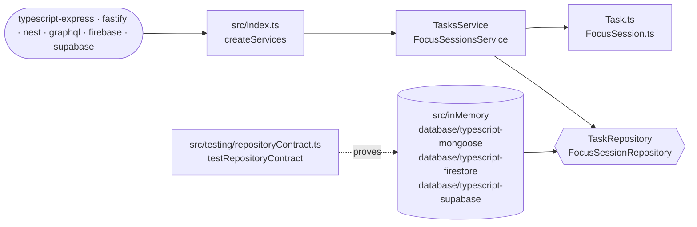

# @cero/core (TypeScript)

The domain and use cases of the Cero API, shared by every TypeScript
implementation. No framework, no database: plain classes and functions.

This is the **reference core**: the Python, Go and Rust cores port it.

```
src/
├── index.ts                 public API + createServices(repositories, { clock })
├── errors.ts                NotFoundError, ValidationError, canonical messages
├── clock.ts                 Clock type and systemClock
├── tasks/
│   ├── Task.ts              types and pure rules (statusForNewTask, renumber, ...)
│   ├── TaskRepository.ts    the storage port
│   └── TasksService.ts      the task use cases
├── focusSessions/
│   ├── FocusSession.ts      types and pure rules (closeOpenPause, finishSession, ...)
│   ├── FocusSessionRepository.ts
│   └── FocusSessionsService.ts
├── inMemory/                in-memory adapter     → "@cero/core/in-memory"
└── testing/                 repository contract   → "@cero/core/testing"
```

## Architecture



1. A transport calls `createServices` with a set of repositories and gets the use cases back; `typescript-nest` builds the services itself.
2. The services apply the rules from the domain files and talk to storage only through the repository ports; refusals are the errors in [`src/errors.ts`](src/errors.ts).
3. Every adapter, the in-memory one included, implements the ports and passes `testRepositoryContract`.

## Using it

```ts
import { createServices } from "@cero/core";
import { createInMemoryRepositories } from "@cero/core/in-memory";

const { tasks, focusSessions } = createServices(createInMemoryRepositories());
await tasks.create({ description: "Write the README" });
```

## Writing a storage adapter

Implement `TaskRepository` and `FocusSessionRepository`, then prove it:

```ts
import { testRepositoryContract } from "@cero/core/testing";

testRepositoryContract("My database", async () => createMyRepositories(await emptyDatabase()));
```

See [`database/typescript-mongoose`](../../database/typescript-mongoose) for a complete example.

## Test it

```bash
yarn workspace @cero/core test
```
