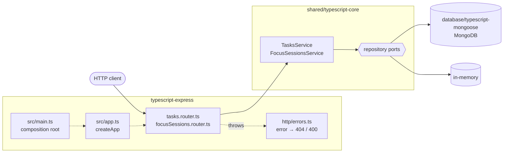

# typescript-express

The Cero API on **Express 5**, storing data in MongoDB through
[`@cero/mongoose`](../database/typescript-mongoose).

## Architecture



1. [`src/main.ts`](src/main.ts) opens the storage that `STORAGE` picks (`mongodb` or `memory`), builds the services with `createServices` and hands them to `createApp`.
2. A router validates the request with zod ([`src/http/validation.ts`](src/http/validation.ts)) and calls one service method.
3. The service applies the business rules and reads or writes through the repository ports.
4. Whatever it throws reaches [`src/http/errors.ts`](src/http/errors.ts): `NotFoundError` → 404, `ValidationError` → 400.

## What this stack shows

- **Express 5 forwards async errors.** Handlers are plain `async` functions with
  no `try/catch`; anything they throw reaches one error middleware
  ([`src/http/errors.ts`](src/http/errors.ts)) that maps core errors to 404/400.
- **Validation is your choice.** Express has none built in, so request bodies
  go through [zod](https://zod.dev) schemas ([`src/http/validation.ts`](src/http/validation.ts)).
- **Routers are factories.** `tasksRouter(tasks)` receives the service it needs,
  so the app is assembled in one place ([`src/app.ts`](src/app.ts)) and is
  reusable: `typescript-firebase` mounts this same app inside a Cloud Function.
- **No build step.** Node runs the TypeScript directly (type stripping).

## Where things live

```
src/
├── main.ts                           composition root: storage → services → app → listen
├── app.ts                            createApp(services): middleware, routers, error handling
├── config.ts                         environment variables
├── http/errors.ts                    404 for unknown routes, error → status code
├── http/validation.ts                zod → ValidationError
├── tasks/tasks.router.ts             /tasks
└── focusSessions/focusSessions.router.ts   /focus-sessions
```

The business rules are not here: they live in
[`shared/typescript-core`](../shared/typescript-core).

## Run it

From the repository root:

```bash
yarn install
docker compose up -d mongo        # or skip it and use STORAGE=memory
cp typescript-express/.env.example typescript-express/.env
yarn workspace typescript-express dev
```

The API listens on http://localhost:3000.

## Test it

```bash
yarn workspace typescript-express test      # Express-specific behaviour
yarn contract typescript-express            # the shared API contract, end to end
```
