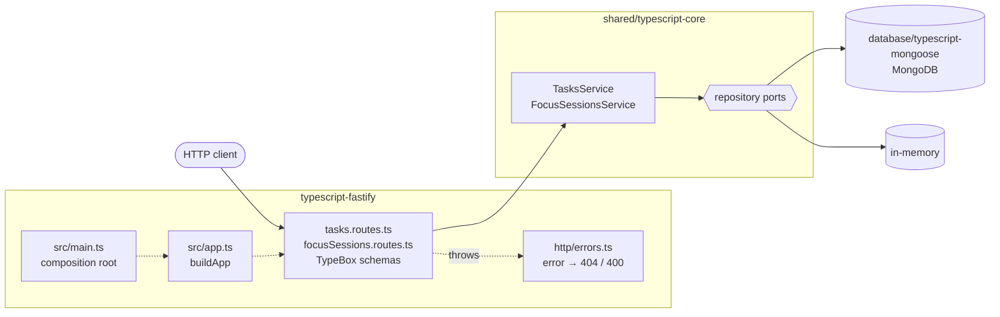

# typescript-fastify

The Cero API on **Fastify 5**, storing data in MongoDB through
[`@cero/mongoose`](../database/typescript-mongoose).

Compare it with [`typescript-express`](../typescript-express): same core, same
storage, only the framework changes.

## Architecture



1. [`src/main.ts`](src/main.ts) opens the storage that `STORAGE` picks (`mongodb` or `memory`), builds the services with `createServices` and hands them to `buildApp`, which registers one plugin per feature.
2. Fastify validates the request against the route's TypeBox schema (with ajv), then the handler calls one service method.
3. The service applies the business rules and reads or writes through the repository ports.
4. Whatever it throws reaches [`src/http/errors.ts`](src/http/errors.ts): `NotFoundError` → 404, `ValidationError` → 400.

## What this stack shows

- **Everything is a plugin.** Each feature is a plugin registered under a
  prefix; the service it needs arrives through the plugin options, which is
  Fastify's way of injecting dependencies ([`src/app.ts`](src/app.ts)).
- **Validation is built in.** Routes declare JSON Schema for params and bodies.
  The schemas are written with [TypeBox](https://github.com/sinclairzx81/typebox),
  so the same definition also types `request.body`.
- **Type coercion is off.** By default Fastify turns `"42"` into `42`; the
  contract wants a 400, so `coerceTypes` is disabled.
- **Hooks.** A `preValidation` hook treats a missing body as `{}`.
- **`inject` for tests.** The tests send requests straight into the app,
  without opening a port ([`test/app.test.ts`](test/app.test.ts)).

## Where things live

```
src/
├── main.ts                                composition root: storage → services → app → listen
├── app.ts                                 buildApp(services): plugins, hooks, error handling
├── config.ts                              environment variables
├── http/errors.ts                         404 for unknown routes, error → status code
├── tasks/tasks.routes.ts                  /tasks plugin
└── focusSessions/focusSessions.routes.ts  /focus-sessions plugin
```

## Run it

From the repository root:

```bash
yarn install
docker compose up -d mongo        # or skip it and use STORAGE=memory
cp typescript-fastify/.env.example typescript-fastify/.env
yarn workspace typescript-fastify dev
```

The API listens on http://localhost:3001.

## Test it

```bash
yarn workspace typescript-fastify test
yarn contract typescript-fastify
```
