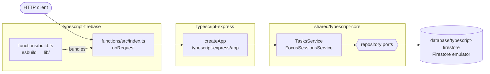

# typescript-firebase

The Cero API as a **Cloud Function for Firebase** (2nd gen), storing data in
**Firestore** through [`@cero/firestore`](../database/typescript-firestore).
It runs locally on the Firebase Emulator Suite, with no Google account.

## Architecture



1. [`functions/src/index.ts`](functions/src/index.ts) builds the services with `createServices` over `createFirestoreRepositories` and hands them to `createApp`.
2. That app is [`typescript-express`](../typescript-express)'s, unchanged: its routers validate with zod, call one service method and map errors to 404/400.
3. The service applies the business rules through the repository ports, here backed by Firestore.
4. [`functions/build.ts`](functions/build.ts) bundles it all into `functions/lib/`, which is what the emulator runs and Firebase deploys.

## What this stack shows

- **Express inside a function.** An Express app is a request handler, and so
  is what `onRequest` takes: the function serves the very same app as
  [`typescript-express`](../typescript-express), imported from
  `typescript-express/app`, only with Firestore underneath
  ([`functions/src/index.ts`](functions/src/index.ts)). This is Firebase's
  documented pattern for Express.
- **Platform-native storage.** Firestore through the Admin SDK, which talks
  to the emulator whenever `FIRESTORE_EMULATOR_HOST` is set (the emulator sets
  it for the function).
- **A demo project.** `.firebaserc` names `demo-cero`: projects starting with
  `demo-` need no credentials and can only reach emulators.
- **A self-contained bundle.** esbuild bundles the function and the workspace
  code it imports into `functions/lib/`, and writes a `package.json` there that
  lists only the runtime dependencies left external (`firebase-functions`,
  `firebase-admin`). `firebase.json` deploys that folder, so a deploy does not
  depend on workspace links ([`functions/build.ts`](functions/build.ts)).
- **Deny-all rules.** Clients never touch Firestore directly; the function's
  Admin SDK bypasses [`firestore.rules`](firestore.rules).

## Where things live

```
typescript-firebase/
├── firebase.json              functions source, Firestore rules and indexes, emulator ports
├── .firebaserc                project: demo-cero
├── firestore.rules            deny every client
├── firestore.indexes.json     composite indexes the list queries need in production
└── functions/                 the workspace package "typescript-firebase"
    ├── src/index.ts           composition root: Firestore → services → Express app → onRequest
    ├── build.ts               esbuild bundle + deploy manifest → lib/
    └── test/api.test.ts       the function serves the app and stores in Firestore
```

The business rules live in [`shared/typescript-core`](../shared/typescript-core),
the HTTP layer in [`typescript-express`](../typescript-express) and the storage
in [`database/typescript-firestore`](../database/typescript-firestore).

## Run it on the emulators

Needs Java 21 (the Firestore emulator is a Java program). The first run
downloads the emulators.

```bash
yarn install
yarn workspace typescript-firebase emulators
```

This builds the bundle and runs `firebase-tools` 15 (through `npx`) with the
functions and Firestore emulators. The API is the function's URL:
http://127.0.0.1:5001/demo-cero/us-central1/api (for example
`GET .../api/tasks`). The Emulator UI is off, because its default port (4000)
is Phoenix's.

| Emulator | Port |
| --- | --- |
| Functions | 5001 |
| Firestore | 8180 (websocket 9180) |
| Hub / logging | 4400 / 4500 |
| Eventarc / Cloud Tasks (started with the functions emulator) | 9280 / 9480 |

The function is loaded a few seconds after port 5001 opens; until then the
emulator answers `404 Function us-central1-api does not exist`.

## Test it

With the emulators running (the tests use the Firestore emulator, in a project
of their own):

```bash
yarn workspace typescript-firebase test     # the function's wiring
yarn workspace @cero/firestore test         # the storage adapter
yarn contract typescript-firebase           # the shared API contract, end to end
```

One contract check cannot pass here: **malformed JSON**. Cloud Functions (and
its emulator) parse JSON bodies before the function runs, so a malformed body
is refused by the platform with a `400` whose body is an HTML error page, not
the contract's `{ message }`. The Express app never sees the request.

## What a real deploy would also need

- A Firebase project on the pay-as-you-go (Blaze) plan, which Cloud Functions
  requires, selected with `firebase use --add` instead of `demo-cero`.
- A Firestore database in that project (Firebase console, or
  `firebase firestore:databases:create`).
- `firebase deploy --only functions,firestore`: it builds the bundle
  (`predeploy`), deploys the function, the rules and the indexes. Composite
  indexes take a few minutes to build; until then the list queries fail.
- A decision about access: the API has no authentication, and HTTPS functions
  are publicly invokable by default. Region, memory and minimum instances
  (cold starts) can be set with `onRequest({ ... }, app)`.
