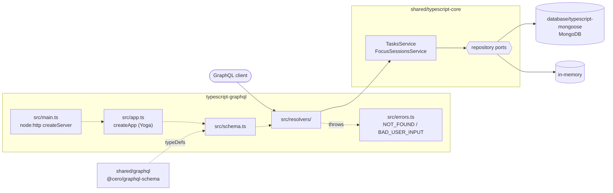

# typescript-graphql

The Cero API as **GraphQL**, on [GraphQL Yoga 5](https://the-guild.dev/graphql/yoga-server)
over Node's `http` module, storing data in MongoDB through
[`@cero/mongoose`](../database/typescript-mongoose).

Same core and storage as [`typescript-express`](../typescript-express); only
the protocol changes. The schema is the shared
[`schema.graphql`](../shared/graphql/schema.graphql), served at `/graphql`.

## Architecture



1. [`src/main.ts`](src/main.ts) opens the storage that `STORAGE` picks (`mongodb` or `memory`), builds the services with `createServices` and mounts the Yoga app on `node:http`.
2. Yoga validates the operation against the shared schema; the services are the context, so each resolver calls one service method.
3. The service applies the business rules and reads or writes through the repository ports.
4. Whatever it throws reaches [`src/errors.ts`](src/errors.ts): `NotFoundError` → `NOT_FOUND`, `ValidationError` → `BAD_USER_INPUT`.

## What this stack shows

- **Schema-first.** The types come from the shared SDL (`@cero/graphql-schema`);
  `createSchema` attaches resolvers to it ([`src/schema.ts`](src/schema.ts)).
  Each resolver calls one use case, found in the context
  ([`src/resolvers/`](src/resolvers)).
- **Enum resolvers.** GraphQL says `IN_PROGRESS`, the core says
  `"in-progress"`; enum resolvers translate both ways
  ([`src/resolvers/enums.ts`](src/resolvers/enums.ts)).
- **A custom scalar.** Timestamps overflow GraphQL's 32-bit `Int`, so `Millis`
  accepts and returns any safe integer, inline or as a variable
  ([`src/resolvers/millis.ts`](src/resolvers/millis.ts)).
- **Absent versus null.** In `updateTask`, a missing `focusSessionId` leaves
  it alone while `null` detaches the task. GraphQL cannot say "optional but not
  null", so the resolver refuses `null` for the other fields
  ([`src/resolvers/tasks.resolvers.ts`](src/resolvers/tasks.resolvers.ts)).
- **Error masking.** Yoga hides every unexpected error behind "Internal server
  error". Core refusals are expected, so a small plugin turns them into GraphQL
  errors first: `NotFoundError` → `extensions.code: "NOT_FOUND"`,
  `ValidationError` → `"BAD_USER_INPUT"`, with the core's message
  ([`src/errors.ts`](src/errors.ts)).
- **Fetch API inside.** The Yoga server is a request handler built on
  `Request`/`Response`: `main.ts` mounts it on `node:http`, and the tests call
  `yoga.fetch` without opening a port ([`test/app.test.ts`](test/app.test.ts)).
- **No build step.** Node runs the TypeScript directly (type stripping).

## Where things live

```
src/
├── main.ts                              composition root: storage → services → Yoga → node:http
├── app.ts                               createApp(services): createYoga with schema, context, plugins
├── schema.ts                            shared SDL + resolvers
├── context.ts                           what resolvers receive: the services
├── errors.ts                            core errors → extensions.code; masking of the rest
├── config.ts                            environment variables
├── http/routeNotFound.ts                404 { message } outside /graphql
└── resolvers/
    ├── tasks.resolvers.ts               Query.tasks, Query.task, task mutations
    ├── focusSessions.resolvers.ts       focus session queries and mutations
    ├── enums.ts                         TaskStatus, FocusSessionStatus
    └── millis.ts                        the Millis scalar
```

The business rules are not here: they live in
[`shared/typescript-core`](../shared/typescript-core).

## Run it

From the repository root:

```bash
yarn install
docker compose up -d mongo        # or skip it and use STORAGE=memory
cp typescript-graphql/.env.example typescript-graphql/.env
yarn workspace typescript-graphql dev
```

Open http://localhost:3003/graphql for GraphiQL.

## Test it

```bash
yarn workspace typescript-graphql test      # GraphQL-specific behaviour
yarn contract typescript-graphql            # the shared API contract, end to end
```
