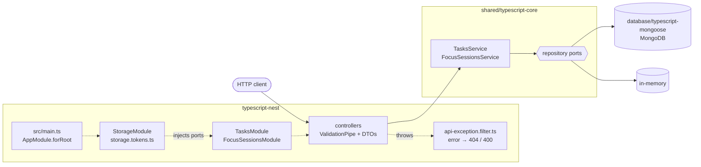

# typescript-nest

The Cero API on **NestJS 12** (Express platform), storing data in MongoDB
through [`@cero/mongoose`](../database/typescript-mongoose).

Compare it with [`typescript-express`](../typescript-express): same core, same
storage, same HTTP server underneath; Nest adds modules and dependency injection
on top.

## Architecture



1. [`src/main.ts`](src/main.ts) passes the config to `AppModule.forRoot` ([`src/app.module.ts`](src/app.module.ts)); `StorageModule` provides the ports for the storage that `STORAGE` picks (`mongodb` or `memory`).
2. Each feature module builds its service with a factory provider from the injected ports; there is no `createServices` here.
3. The global `ValidationPipe` checks the body against a class-validator DTO, then the controller calls one service method, which applies the rules through the ports.
4. Whatever it throws reaches [`src/common/api-exception.filter.ts`](src/common/api-exception.filter.ts): `NotFoundError` → 404, `ValidationError` → 400.

## What this stack shows

- **Modules and dependency injection.** Each feature is a module with a
  controller ([`src/tasks/tasks.module.ts`](src/tasks/tasks.module.ts)). The
  core's services are plain classes, so **factory providers** build them from
  the injected storage ports.
- **Injection tokens for interfaces.** The core's repository ports are
  TypeScript interfaces, which vanish at runtime, so they are injected by
  explicit tokens ([`src/storage/storage.tokens.ts`](src/storage/storage.tokens.ts)).
- **A dynamic module picks the storage.** `StorageModule.forRoot(options)`
  provides MongoDB or in-memory repositories, waits for the connection through
  an async factory, and closes it in `onApplicationShutdown`
  ([`src/storage/storage.module.ts`](src/storage/storage.module.ts)).
- **DTOs and a global `ValidationPipe`.** Bodies are classes decorated with
  [class-validator](https://github.com/typestack/class-validator)
  ([`src/tasks/dto/`](src/tasks/dto)); `whitelist` drops fields the DTO does
  not declare, such as an `id`. `@IsOptional()` lets `null` through, so fields
  that may be omitted but never null use a small `@IsOmittable()`
  ([`src/common/is-omittable.decorator.ts`](src/common/is-omittable.decorator.ts)).
- **One exception filter.** A catch-all filter turns core errors, Nest's
  `HttpException`s and unknown routes into the contract's `{ message }`
  ([`src/common/api-exception.filter.ts`](src/common/api-exception.filter.ts)).
  The pipe and the filter are registered as `APP_PIPE`/`APP_FILTER` providers,
  so tests built from `AppModule` get them too.
- **Route order.** `@Patch(":id/complete")` and `@Patch(":id/reset")` are
  declared before `@Patch(":id/:status")`, because Express matches in order.
- **A build step, with SWC.** Nest reads constructor parameter types at
  runtime (decorator metadata), which Node's type stripping cannot emit. The
  Nest CLI compiles `src/` with SWC into `dist/` ([`nest-cli.json`](nest-cli.json),
  [`.swcrc`](.swcrc)). The compiled app still imports `@cero/core` as `.ts`
  source, which Node runs by stripping its types.

## Where things live

```
src/
├── main.ts                                  composition root: AppModule.forRoot(config) → listen
├── app.module.ts                            root module: features, global pipe and filter
├── config.ts                                environment variables
├── storage/storage.module.ts                StorageModule.forRoot: MongoDB or memory
├── storage/storage.tokens.ts                injection tokens for the repository ports
├── common/api-exception.filter.ts           error → { message } and status code
├── common/is-omittable.decorator.ts         "may be absent, never null"
├── tasks/                                   TasksModule, TasksController, DTOs
└── focus-sessions/                          FocusSessionsModule, FocusSessionsController, DTOs
```

The business rules are not here: they live in
[`shared/typescript-core`](../shared/typescript-core).

## Run it

From the repository root:

```bash
yarn install
docker compose up -d mongo        # or skip it and use STORAGE=memory
cp typescript-nest/.env.example typescript-nest/.env
yarn workspace typescript-nest dev     # nest start --watch
```

The API listens on http://localhost:3002. `yarn workspace typescript-nest start`
builds once and runs `dist/main.js`.

## Test it

```bash
yarn workspace typescript-nest test      # Nest-specific behaviour (@nestjs/testing + supertest)
yarn contract typescript-nest            # the shared API contract, end to end
```

The tests run on `node:test` like every other TypeScript stack; they load
through [`@swc-node/register`](https://github.com/swc-project/swc-node) so the
decorators get their metadata there too.
